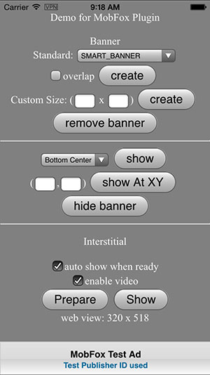
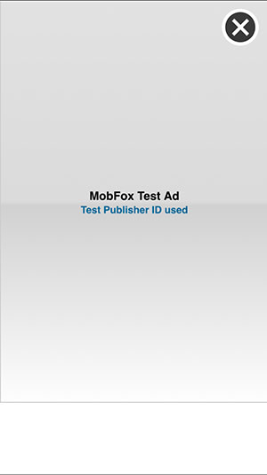
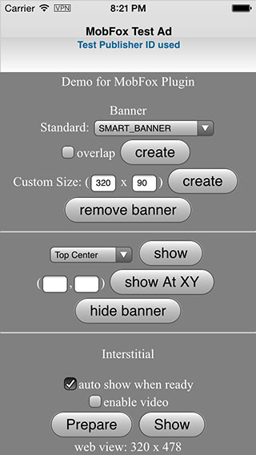
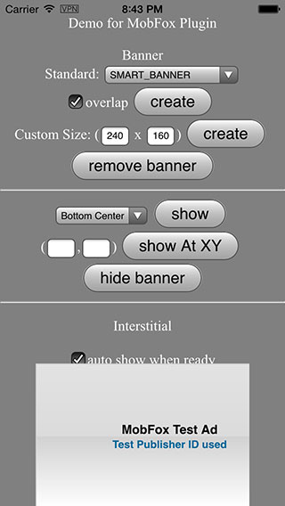

# MobFox Plugin Pro #

Present MobFox Ads in Mobile App/Games natively from JavaScript. 

Highlights:
- [x] Easy-to-use APIs. Display Ad with single line of Js code.
- [x] Support Banner, Interstitial Ad, and Video Ad.
- [x] One plugin supports both Android and iOS platform.
- [x] Multiple banner size, also support custom size.
- [x] Fixed and overlapped mode.
- [x] Auto fit on orientation change.

Compatible with:

* [x] Cordova CLI, v3.5+
* [x] Intel XDK and Crosswalk, r1095+
* [x] IBM Worklight, v6.2+
* [x] Google Mobile Chrome App
* [x] Adobe PhoneGap Build, since 2014/12/9

## How to use? ##

* If use with Cordova CLI:
```
cordova plugin add com.rjfun.cordova.mobfox
```

* If use with PhoneGap Buid, just configure in config.xml:
```javascript
<gap:plugin name="com.rjfun.cordova.mobfox" source="plugins.cordova.io"/>
```

* If use with Intel XDK:
Project -> CORDOVA 3.X HYBRID MOBILE APP SETTINGS -> PLUGINS AND PERMISSIONS -> Third-Party Plugins ->
Add a Third-Party Plugin -> Get Plugin from the Web, input:
```
Name: MobFoxPluginPro
Plugin ID: com.rjfun.cordova.mobfox
[x] Plugin is located in the Apache Cordova Plugins Registry
```

## Quick start with cordova CLI ##

Add the plugin to your cordova project with [Cordova CLI](https://cordova.apache.org/docs/en/edge/guide_cli_index.md.html#The%20Command-Line%20Interface):
```bash
cordova create <project_folder> com.<company_name>.<app_name> <AppName>
cd <project_folder>
cordova platform add android
cordova platform add ios

cordova plugin add com.rjfun.cordova.mobfox

// copy the demo html file to www
rm -r www/*; cp plugins/com.rjfun.cordova.mobfox/test/index.html www/

// connect device or run in emulator
cordova prepare; cordova run android; cordova run ios;

// or import into Xcode / eclipse
```

## Quick Start Example Code ##

Step 1: Prepare your Mobfox publisher Id for your app, create it in [MobFox website](http://www.mobfox.com/)

```javascript
var ad_units = {
	ios : "publisher_id_for_ios_xxx",
	android : "publisher_id_for_android_xxx"
};

// select the right Ad Id according to platform
var publisherId = ( /(android)/i.test(navigator.userAgent) ) ? ad_units.android : ad_units.ios;
```

Step 2: Create a banner with single line of javascript

```javascript
// it will display smart banner at top center, using the default options
if(MobFox) MobFox.createBanner( publisherId );
```

Or, show the banner Ad in some other way:

```javascript
// or, show a default banner at bottom
if(MobFox) MobFox.createBanner( {
	adId: publisherId, 
	position:MobFox.AD_POSITION.BOTTOM_CENTER, 
	autoShow:true} );
```

Step 3: Prepare an interstitial, and show it when needed

```javascript
// preppare and load ad resource in background, e.g. at begining of game level
if(MobFox) MobFox.prepareInterstitial( {adId:publisherId, autoShow:false} );

// show the interstitial later, e.g. at end of game level
if(MobFox) MobFox.showInterstitial();
```

Step 4: Prepare an video Ad, and show it when needed

```javascript
// preppare and load ad resource in background, e.g. at begining of game level
if(MobFox) MobFox.prepareInterstitial( {adId:publisherId, enableVideo:true, autoShow:false} );

// show the interstitial later, e.g. at end of game level
if(MobFox) MobFox.showInterstitial();
```

## Javascript API Overview ##

Methods:
```javascript
// set default value for other methods
setOptions(options, success, fail);

// for banner
createBanner(adId/options, success, fail);
removeBanner();
showBanner(position);
showBannerAtXY(x, y);
hideBanner();

// for interstitial
prepareInterstitial(adId/options, success, fail);
showInterstitial();
```

## Detailed Documentation ##

The APIs, Events and Options are detailed documented.

Read the detailed API Reference Documentation [English](https://github.com/floatinghotpot/cordova-mobfox-pro/wiki).

## FAQ ##

If encounter problem when using the plugin, please read the [FAQ](https://github.com/floatinghotpot/cordova-mobfox-pro/wiki/FAQ) first.

## Full Example Code ##

This MobFox Plugin Pro offers the most flexibility and many options.

Check the [test/index.html] (https://github.com/floatinghotpot/cordova-mobfox-pro/blob/master/test/index.html).

## Screenshots ##

Banner | Interstitial | Video
-------|------------|--------
 |  | 
 any size | overlap
 | 

Ad PluginPro series for the world leading Mobile Ad services:

* [GoogleAds PluginPro](https://github.com/floatinghotpot/cordova-admob-pro), for Google AdMob/DoubleClick.
* [iAd PluginPro](https://github.com/floatinghotpot/cordova-iad-pro), for Apple iAd. 
* [FacebookAds PluginPro](https://github.com/floatinghotpot/cordova-plugin-facebookads), for Facebook Audience Network.
* [FlurryAds PluginPro](https://github.com/floatinghotpot/cordova-plugin-flurry), for Flurry Ads.
* [mMedia PluginPro](https://github.com/floatinghotpot/cordova-plugin-mmedia), for Millennial Meida.
* [MobFox PluginPro](https://github.com/floatinghotpot/cordova-mobfox-pro), for MobFox.
* [MoPub PluginPro](https://github.com/floatinghotpot/cordova-plugin-mopub), for MoPub.

More Cordova/PhoneGap plugins by Raymond Xie, [find them in plugin registry](http://plugins.cordova.io/#/search?search=rjfun).

If use in commercial project or need prompt support, please [buy a license](http://rjfun.github.io/), you will be served with high priority.

Project outsourcing and consulting service is also available. Please [contact us](mailto:rjfun.mobile@gmail.com) if you have the business needs.

